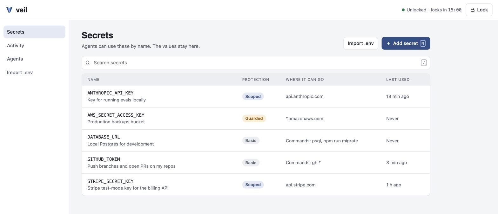

<p align="center">
  <picture>
    <source media="(prefers-color-scheme: dark)" srcset="docs/images/logo-dark.svg">
    
  </picture>
</p>

<p align="center"><b>ให้ AI agent ใช้ secret ของคุณได้ โดยไม่ต้องเห็นค่าจริง</b></p>

<p align="center"><a href="README.md">English</a> · <a href="docs/usage.th.md">คู่มือการใช้งาน</a> · <a href="docs/threat-model.th.md">Threat model</a></p>

AI coding agent ต้องใช้ API key และ token ถึงจะทำงานจริงได้ ทุกวันนี้วิธีที่ใช้กันส่วนใหญ่คือ
แปะ key ลงในแชต หรือทิ้งไว้ในไฟล์ `.env` ที่ agent อ่านได้ ไม่ว่าทางไหน ค่าจริงก็ไปอยู่ใน
context ของโมเดล ใน transcript และใน log

Veil เก็บ secret ของคุณแบบเข้ารหัสไว้บนเครื่อง และให้ agent ใช้งานได้ **ด้วยชื่อ** เท่านั้น
agent ขอให้ Veil รันคำสั่งหรือส่ง request ให้ แล้ว Veil จะใส่ค่าจริงเข้าไปในวินาทีสุดท้าย
นอก agent และซ่อนค่านั้นถ้ามันโผล่มาใน output

```text
Agent:  http_request  POST https://api.stripe.com/v1/refunds
                      Authorization: Bearer {{secret:STRIPE_SECRET_KEY}}
Veil:   ✓ api.stripe.com is allowed for STRIPE_SECRET_KEY → sends it
Agent:  sees the response, never the key
```

> **สถานะ: ยังอยู่ในช่วงแรก (v0.2)** Veil ใช้งานได้และมีเทสครอบคลุม แต่ยังไม่ผ่านการตรวจ
> ความปลอดภัยจากผู้ตรวจภายนอก บน macOS มีแค่ตัว Veil เองที่อ่าน master key ได้ ส่วนบน Linux
> โปรแกรมใดก็ตามที่รันในนามของคุณอ่านได้ ดูว่าครอบคลุมอะไรบ้างอย่างละเอียดได้ที่
> [threat model](docs/threat-model.th.md)

## ติดตั้ง

```sh
# Homebrew (macOS, Linux): build จาก source ที่ติด tag
brew install moomdate/tap/veil

# หรือใช้ Go 1.26 ขึ้นไป (บน macOS ต้องมี Xcode command line tools)
go install github.com/moomdate/veil/cmd/veil@latest
```

binary สำเร็จรูปพร้อม checksum, SBOM และลายเซ็น cosign ดาวน์โหลดได้ที่
[หน้า releases](https://github.com/moomdate/veil/releases)

บน macOS คำสั่ง `veil` ครั้งแรกจะ sign ตัว binary ด้วย hardened runtime เพื่อไม่ให้โปรแกรมอื่น
แทรกโค้ดเข้าไปได้ (ไม่ต้องมีบัญชี Apple) หลังจากนั้น macOS อาจถามรหัสผ่านหนึ่งครั้งเพื่ออนุญาต
ให้ Veil ใช้ key ของมัน และจะถามอีกครั้งหลังอัปเดตแต่ละครั้ง

## เริ่มใช้งาน

```sh
veil init                                   # create your vault; its key goes in your system keychain
veil add STRIPE_SECRET_KEY --domain api.stripe.com -d "Stripe test key"
veil add GITHUB_TOKEN --tier basic --command "gh *"
veil connect claude                         # or: cursor, other
```

จากนั้นลองสั่ง agent เช่น *"list my secrets"* หรือ *"open a PR with gh"* ได้เลย
คุณไม่ต้องแปะค่าจริงลงในแชตอีกเลย

ชอบคลิกมากกว่า? `veil ui` จะเปิดหน้าเว็บในเบราว์เซอร์ให้คุณเพิ่ม ตรวจดู และลบ secret
ดูว่า agent ทำอะไรไปบ้าง และ import ไฟล์ `.env` หน้านี้ทำงานบนเครื่องคุณเท่านั้น และล็อกตัวเอง
หลังไม่มีการใช้งาน 15 นาที การแสดงค่าจริง หรือการอนุญาตให้ secret ถูกส่งไปที่ใหม่ จะต้องยืนยัน
ด้วย Touch ID หรือรหัสผ่าน



ดู[คู่มือการใช้งาน](docs/usage.th.md)สำหรับการใช้งานแบบทีละขั้นพร้อมภาพหน้าจอ

มีไฟล์ `.env` อยู่แล้ว? `veil import .env` จะย้ายค่าเข้า Veil และเสนอให้ลบไฟล์ทิ้ง

`veil add` จะถามค่าผ่าน prompt แบบซ่อนตัวอักษร หรืออ่านจาก pipe
(`pbpaste | veil add NAME ...`) และจะไม่รับค่าเป็น argument เด็ดขาด
เพราะ argument จะไปค้างอยู่ใน shell history

## ระดับการป้องกัน

secret ทุกตัวมีระดับการป้องกันหนึ่งในสามระดับ ให้เลือกระดับที่เข้มที่สุดที่ยังใช้งานได้

| ระดับ | agent ใช้งานได้อย่างไร | เหมาะกับ |
|---|---|---|
| **Scoped** (ค่าเริ่มต้น) | ใช้ได้เฉพาะใน HTTP request ไปยัง host ที่คุณระบุ และโดยค่าเริ่มต้นใส่ได้เฉพาะใน header | API key เช่น Stripe, OpenAI, GitHub API |
| **Basic** | ใช้เป็น environment variable ให้คำสั่งที่คุณอนุญาต (หรือคำสั่งใดก็ได้) Veil จะสแกน output และซ่อนค่าให้ | CLI ที่อ่าน token จาก environment เช่น `gh`, `psql` |
| **Guarded** | เหมือน Scoped แต่คุณต้องอนุมัติทุกครั้งที่ใช้ *ระบบอนุมัติจะมาใน v0.4 จนถึงตอนนั้น agent จะยังใช้ secret ระดับ Guarded ไม่ได้* | key ของ production และระบบเรียกเก็บเงิน |

secret ระดับ Scoped จะถูกใส่ได้เฉพาะใน **header** ของ request เท่านั้น เว้นแต่คุณจะเปิดให้
เพิ่มด้วย `--allow-in url,body` เพราะค่าที่อยู่ใน URL หรือ body อาจถูก server เก็บไว้
(ใน gist, issue หรือ log) แล้วถูกอ่านกลับออกมาทีหลังได้ ซึ่งจะทำให้การป้องกันทั้งหมดไม่มีความหมาย

## คำสั่ง

| คำสั่ง | ทำอะไร |
|---|---|
| `veil init` | สร้าง vault |
| `veil add NAME` | เก็บ secret (ใช้ `--update` เพื่อแทนที่ตัวเดิม) |
| `veil list` | แสดง secret และกฎของแต่ละตัว โดยไม่แสดงค่า (ใช้ `--json` สำหรับ script) |
| `veil rm NAME` | ลบ secret |
| `veil run -s NAME -- cmd ...` | รันคำสั่งโดยใส่ secret ระดับ Basic ไว้ใน environment |
| `veil log` | ดูการใช้งานล่าสุด ว่าอะไรถูกใช้ agent ตัวไหนใช้ และอะไรถูกบล็อก |
| `veil ui` | จัดการทุกอย่างผ่านเบราว์เซอร์ |
| `veil import FILE` | ย้าย secret จากไฟล์ `.env` เข้า Veil |
| `veil protect` | sign Veil ใหม่เพื่อกันการแทรกโค้ด (macOS; ทำให้อัตโนมัติ) |
| `veil connect AGENT` | ตั้งค่าให้ Claude Code หรือ Cursor หรือพิมพ์ MCP config ออกมา |
| `veil mcp` | MCP server ที่ agent เป็นคนสั่งรัน (คุณไม่ต้องรันเอง) |

## agent เห็นอะไรบ้าง

Veil มี MCP tool ให้ agent ใช้ 3 ตัว และไม่มีตัวไหนคืนค่าจริงออกไป

- `list_secrets`: ชื่อ คำอธิบาย ระดับการป้องกัน และวิธีใช้ของแต่ละตัว
- `run_with_secrets`: รันคำสั่งโดยมี secret ระดับ Basic เป็น environment variable
- `http_request`: ส่ง request ที่มี placeholder `{{secret:NAME}}`

ถ้าค่าจริงโผล่ใน output ใดก็ตาม agent จะเห็นเป็น `[HIDDEN:NAME]` แทน ครอบคลุมทั้งค่าดิบ
และ encoding ที่พบบ่อย ได้แก่ base64 (รวมถึงกรณีที่แฝงอยู่ใน base64 ที่ยาวกว่า), hex,
URL-escaped และ JSON-escaped

## ไฟล์อยู่ที่ไหน

| Path | คืออะไร |
|---|---|
| `~/.veil/vault.json` | secret และกฎทั้งหมดแบบเข้ารหัส (XChaCha20-Poly1305) |
| `~/.veil/audit.log` | บันทึกการใช้งานทุกครั้งในรูปแบบ JSON Lines โดยเก็บแค่ชื่อ |
| System keychain, service `veil` | master key ของ vault บน macOS มีแค่ Veil ที่อ่านได้ |

ตั้งค่า `VEIL_HOME` ถ้าต้องการใช้ directory อื่น

## Roadmap

- **v0.1**: vault, CLI, MCP server, การซ่อนค่า (redaction), กฎเรื่อง host และคำสั่ง, audit log
- **v0.2** (ตอนนี้): master key ที่มีแค่ Veil อ่านได้ (macOS), web UI ผ่าน `veil ui`, import จาก `.env`
- **v0.3**: กฎ HTTP ที่ละเอียดขึ้น, กำหนดสิทธิ์แยกตาม agent
- **v0.4**: ระบบอนุมัติสำหรับ secret ระดับ Guarded ด้วย Touch ID
- **v0.5**: Claude Code hooks, การหมุนเปลี่ยน key (rotation), backup แบบเข้ารหัส

## ร่วมพัฒนา

ดู [CONTRIBUTING.th.md](CONTRIBUTING.th.md) ถ้าจะรายงานปัญหาด้านความปลอดภัย ดู
[SECURITY.th.md](SECURITY.th.md) และกรุณาอย่าเปิด issue สาธารณะสำหรับเรื่องเหล่านี้

## License

[Apache 2.0](LICENSE)
