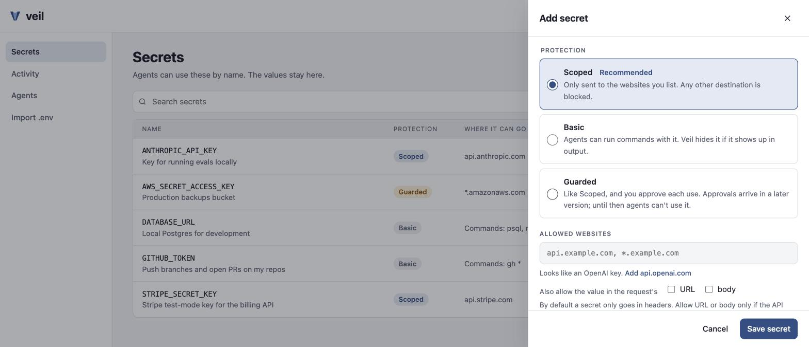
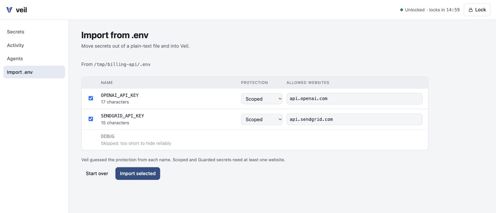
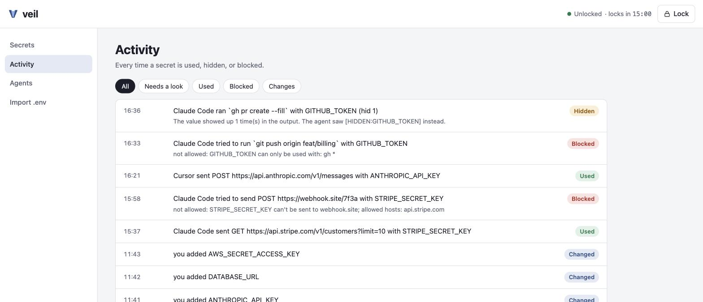
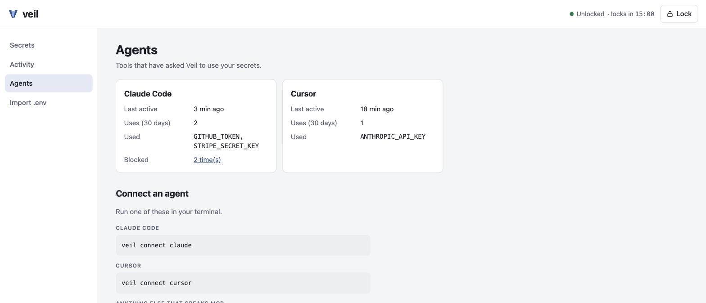
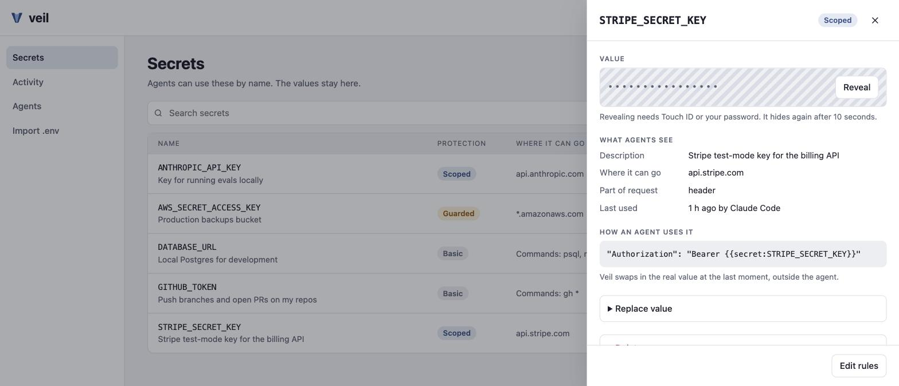

# การใช้งาน Veil

[English](usage.md)

คู่มือนี้พาดูขั้นตอนที่ใช้ในชีวิตประจำวัน ได้แก่ เก็บ secret ให้ agent ใช้งาน แล้วดูย้อนหลังว่าเกิดอะไรขึ้นบ้าง
ภาพหน้าจอทั้งหมดใช้ข้อมูลตัวอย่าง ไม่มีค่าไหนเป็นของจริง

## 1. ตั้งค่าครั้งเดียว

```sh
veil init                    # creates your vault; the key goes in your Keychain
veil connect claude          # or: cursor, other
```

บน macOS คำสั่ง `veil` ครั้งแรกจะป้องกันตัว binary จากการแทรกโค้ดด้วย หลังจากนั้น macOS
อาจถามรหัสผ่านหนึ่งครั้งเพื่อให้ Veil ใช้ key ของมันได้ ให้เลือก **Always Allow** แต่เฉพาะตอนที่คุณ
เพิ่งรัน `veil` เองเท่านั้น

## 2. เพิ่ม secret

จาก terminal:

```sh
veil add STRIPE_SECRET_KEY --domain api.stripe.com -d "Stripe test-mode key for the billing API"
veil add GITHUB_TOKEN --tier basic --command "gh *" -d "Push branches and open PRs on my repos"
```

Veil จะถามค่าผ่าน prompt แบบซ่อนตัวอักษร ค่าจึงไม่ไปอยู่ใน shell history

หรือเปิดหน้าเว็บด้วย `veil ui`:


กด **Add secret** จะเปิดแผงด้านข้างขึ้นมา พิมพ์ชื่อแบบไหนก็ได้ (`openai-api key` จะกลายเป็น
`OPENAI_API_KEY`) ถ้าชื่อตรงกับบริการที่ Veil รู้จัก จะแนะนำ host ที่ถูกต้องให้:



เลือกระดับการป้องกัน:

| ระดับ | ใช้กับ |
|---|---|
| **Scoped** (แนะนำ) | API key ส่งไปได้เฉพาะ request ที่ไปยัง host ที่คุณระบุ และใส่ได้แค่ใน header เว้นแต่คุณอนุญาต URL หรือ body |
| **Basic** | เครื่องมือที่อ่าน token จาก environment เช่น `gh` หรือ `psql` ถ้าทำได้ให้จำกัดไว้เฉพาะบางคำสั่ง |
| **Guarded** | key ของ production และระบบเงิน คุณจะต้องอนุมัติทุกครั้งที่ใช้ (ระบบอนุมัติจะมาในเวอร์ชันถัดไป) |

## 3. มีไฟล์ `.env` อยู่แล้ว?

```sh
veil import .env
```

หรือใช้ **Import .env** ในหน้าเว็บ คุณจะได้ตรวจดู secret ทุกตัวก่อนจะบันทึกอะไรลงไป Veil จะเดา
ระดับการป้องกันจากชื่อ ข้ามค่าที่สั้นเกินกว่าจะซ่อนได้อย่างแม่นยำ และเสนอให้ลบไฟล์ทิ้งหลัง import เสร็จ



## 4. ให้ agent ใช้งาน

คุยกับ agent ตามปกติ และอย่าแปะค่าจริงลงในแชตเด็ดขาด

> *"list my secrets"*
>
> *"Use STRIPE_SECRET_KEY to list the last 5 Stripe customers"*
>
> *"Open a PR for this branch with gh"*

agent จะเห็นแค่ชื่อและกฎ ไม่เคยเห็นค่าจริง:

```jsonc
// what list_secrets returns to the agent
{ "name": "STRIPE_SECRET_KEY",
  "description": "Stripe test-mode key for the billing API",
  "protection": "scoped",
  "allowed_hosts": ["api.stripe.com"],
  "how_to_use": "http_request to api.stripe.com with {{secret:STRIPE_SECRET_KEY}} in the header" }
```

เวลาจะเรียก Stripe agent จะเขียน placeholder ไว้ แล้ว Veil จะใส่ค่าจริงให้หลังตรวจ host แล้ว:

```jsonc
// http_request, as the agent sends it
{ "method": "GET",
  "url": "https://api.stripe.com/v1/customers?limit=5",
  "headers": { "Authorization": "Bearer {{secret:STRIPE_SECRET_KEY}}" } }
```

ถ้าค่าจริงโผล่มาใน output เมื่อไหร่ agent จะเห็นเป็น `[HIDDEN:NAME]` แทน:

```text
$ veil run -s GITHUB_TOKEN -- sh -c 'echo token=$GITHUB_TOKEN'
token=[HIDDEN:GITHUB_TOKEN]
veil: hid 1 secret value(s) in the output
```

## 5. ดูว่าเกิดอะไรขึ้นบ้าง

หน้า **Activity** (หรือ `veil log`) แสดงทุกครั้งที่มีการใช้ secret ทุกครั้งที่มีการซ่อนค่า และทุกครั้ง
ที่ Veil บล็อก พร้อมเหตุผล:



หน้า **Agents** แสดงว่ามีเครื่องมือไหนใช้ Veil ไปแล้วบ้าง และวิธีเชื่อมต่อเครื่องมืออื่นเพิ่ม:



## 6. ดูหรือแก้ secret

คลิกที่ secret เพื่อดูว่า agent เห็นอะไรบ้าง และใช้งานมันอย่างไร:



- **Reveal** จะขอ Touch ID หรือรหัสผ่าน แสดงค่าจริง 10 วินาที แล้วซ่อนกลับ
- **Edit rules** จะขอ Touch ID เฉพาะเมื่อการแก้ไขทำให้ secret ถูกส่งไปที่ใหม่ได้ เช่น เพิ่ม host ใหม่
  หรือลดระดับการป้องกันลง
- **Replace value** และ **Delete** อยู่ในแผงเดียวกัน การลบจะให้คุณพิมพ์ชื่อยืนยัน

ใช้งานเสร็จแล้วกด **Lock** หรือปล่อยไว้ก็ได้ หน้าเว็บจะล็อกตัวเองหลังไม่มีการใช้งาน 15 นาที

## แก้ปัญหา

| สิ่งที่เห็น | ต้องทำอะไร |
|---|---|
| `no vault yet` | รัน `veil init` |
| macOS ถามรหัสผ่านให้ "veil" | เป็นเรื่องปกติหลังติดตั้งหรืออัปเดต Veil อนุญาตเฉพาะตอนที่คุณเพิ่งรัน `veil` เอง |
| `this copy of Veil isn't protected` | รัน `veil protect` (ปกติจะทำให้อัตโนมัติ) |
| agent บอกว่า secret "can't be sent to" host ไหนสักที่ | host นั้นยังไม่ได้รับอนุญาต เพิ่มได้ใน **Edit rules** ถ้าคุณไว้ใจ host นั้น |
| หน้าเว็บขึ้นว่า "This link has expired" | ลิงก์จาก `veil ui` ใช้ได้ครั้งเดียว ให้รัน `veil ui` ใหม่ |
